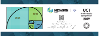
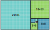
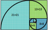

UCT Maths Mug 2019
==================

[j5 International](https://j5int.com/), now part of [Hexagon PPM](https://hexagonppm.com/) is a sponsor of the 
[UCT Mathematics Competition](http://www.uctmathscompetition.org.za/).

Prizewinners in 2019 received a mug with the competition logo, the Hexagon PPM and j5 logos,
and a representation of the *Fibonacci Spiral*.

For more information on the Fibonacci Spiral, read on!
If you look carefully, you should also be able to spot a Fibonacci Spiral in the following video, which demonstrates the advantage of being part of a company named after a mathematical shape:

For more information on previous mugs, please see:

* The [2018 mug](https://github.com/j5int/uct-maths-mug/blob/2018/README.md) which contained a program for calculating the digits of PI.

Fibonacci numbers
-----------------

High school mathematicians will hopefully have encountered the [Fibonacci numbers](https://en.wikipedia.org/wiki/Fibonacci_number) already.
These numbers form a sequence, starting with 0 and 1, where each number is the sum of the two preceding ones.
[The sequence is defined](https://artofproblemsolving.com/wiki/index.php/Fibonacci_sequence) as follows:

(Often, the initial zero is omitted and the sequence starts with two 1s, but this makes no difference to the following terms).

The sequence starts with:

* (0), 1, 1, 2, 3, 5, 8, 13, 21, 34, 55, 89, 144, ...

Fibonacci Spiral
----------------

The _Fibonacci Spiral_ is a geometric construction that starts with two squares of size one, alongside each other.
Each subsequent square is constructed on the side of the two previous squares, so that the length of its side is the same as the sum of the length of their sides.
In this way, the length of the sides of the squares exactly reproduces the Fibonacci sequence.

To generate the spiral, simply inscribe a circular arc in each square, with the center at the vertex of the square in common with the two subsequent squares,
and the arc going between the two closest vertices of the square.

Golden Ratios and Spirals
-------------------------

This spiral approximates the [Golden Spiral](https://en.wikipedia.org/wiki/Golden_spiral),
since the ratio between consecutive terms of the Fibonacci sequence tends towards the [Golden Ratio](https://en.wikipedia.org/wiki/Golden_ratio).

This can be seen through [Binet's formula](https://artofproblemsolving.com/wiki/index.php/Binet%27s_Formula) for the Fibonacci sequence:

